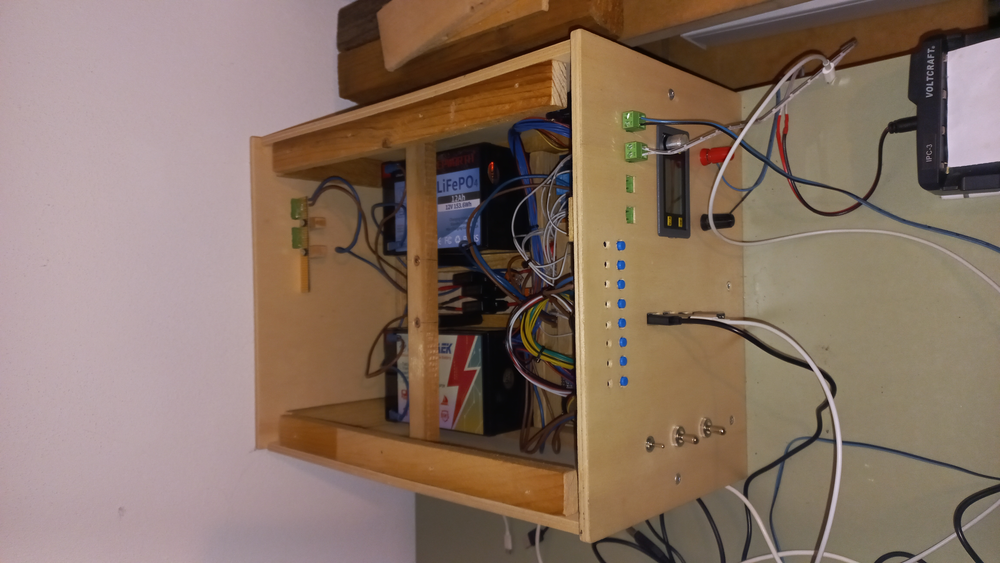
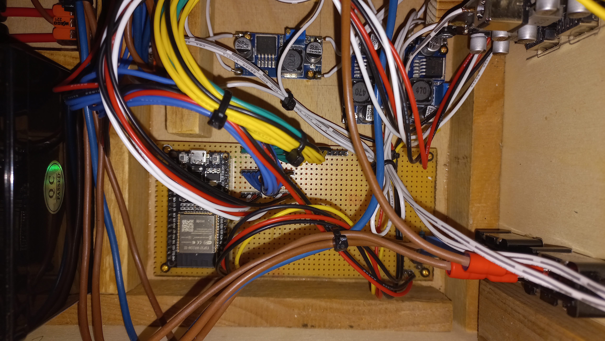
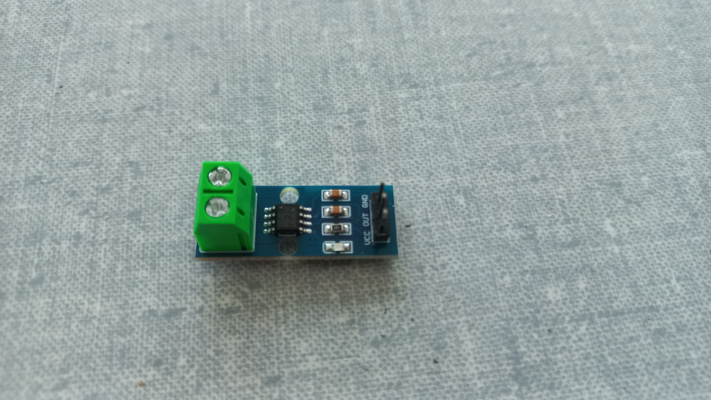
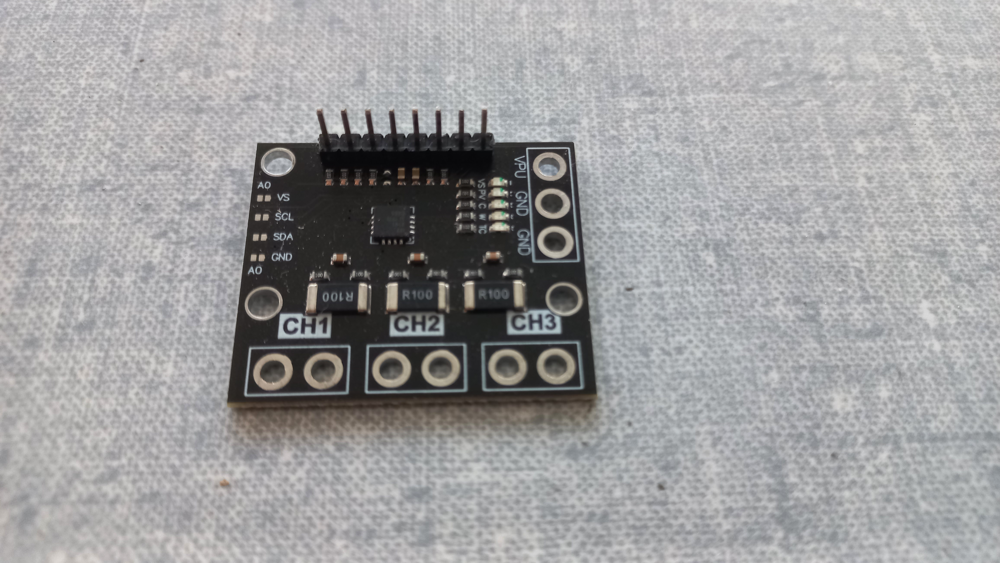
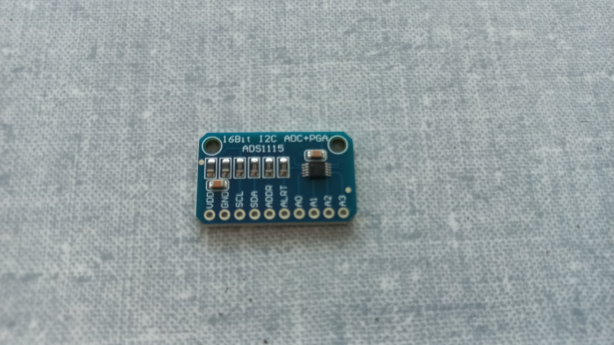
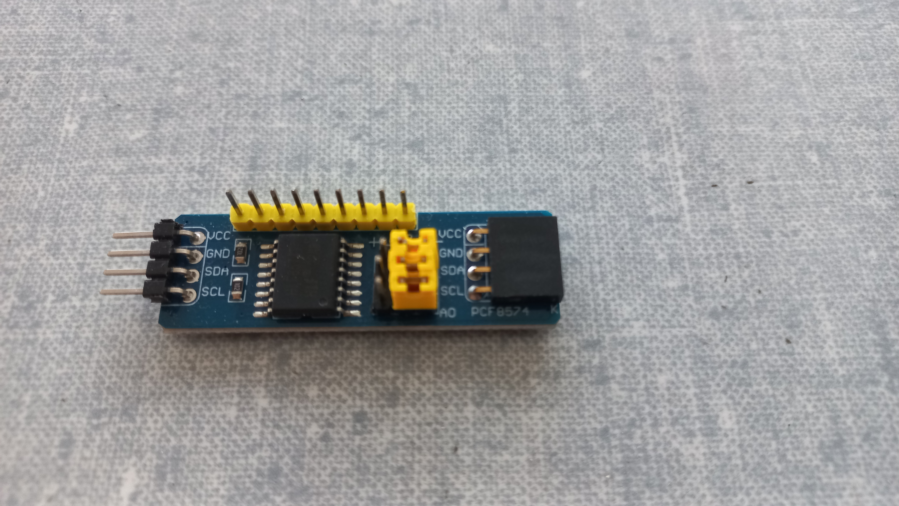

# Eingebettete Systeme Projekt: Solarkiste
## Projektidee
Die bereits bestehende "Solarkiste" soll um ein paar praktische Funktionen erweitert werden.
Bei der "Solarkiste" handelt es sich um eine selbst gebaute Holzkiste mit zwei LiFePo4-Akkus, an der jede Menge Geräte angeschlossen werden können.
Die Kiste wird primär verwendet, um in der Nacht Hadys und Laptops zu laden, kann aber zum Beispiel auch für den Betrieb eines Inverters für eine 230V Versorgung verwendet werden.
Wie der Name vermuten lässt, wird die Kiste an einem sonnigen Tag mit einem kleinen (50W) Photovoltaikmodul versorgt und die Akkus aufgeladen.

Im Zuge dieses Projekts sollen folgende Funktionen ergänzt werden:
* Leistungs- bzw. Energiemonitoring des Akkus und eventuell ausgewählter Ausgänge
* Temperaturüberwachung des MPP-Trackers ("Laderegler") sowie des Labornetzteils
* Entsprechende Kühlung mit PWM-Steuerung für einen Lüfter
* Steuerung einzelner Ausgänge mit dem Relaismodul, sowie den Tastern und Kontrollleuchten
* Einbindungsmöglichkeit in ein Smart-Home-System per WLAN und MQTT-Protokoll
* evt. Kleines Webinterface für einfache Anzeige und Steuerung

## Peripherie / verwendete Hardware
* ESP32 WROOM32 (Dev-Board) $\rightarrow$ falls gewünscht ersatzweise das ESP32-C3 Dev-Board der FH
* diverse GPIOs des ESP32
* 10k NTC Termistor (Analog)
* ACS712 Hall-Stromsensor (Analog)
* ggf. INA3221 Power-Monitor (I²C)
* ggf. ADS1115 4-Kanal 16 Bit Analog-Digital-Wandler (I²C) $\rightarrow$ Alternative: interner ADC des ESP32
* ggf. PFC8574 IO-Expander (I²C)

## Umsetzung
### Leistungs- bzw. Energiemonitoring
Im Fokus steht das Monitoring von Leistung und Energie und damit auch die Ermittlung des SOC (state of charge) des Akkus.
Dazu verwendet werden soll der Hall-Stromsensor (Strommessung) sowie ein einfacher Widerstandsteiler (Spannungsmessung) in Kombination mit dem I²C AD-Wandler (aus Gründen der Genauigkeit).

### Temperaturüberwachung
Es sollen zwei Temperaturen ermittelt werden:
1) Temperatur des MPP-Trackers
2) Temperatur des Labornetzteils
Der Analogwert soll mit dem I²C AD-Wandler (aus Gründen der Genauigkeit) ermittelt werden.

### PWM-Lüfter
Mit den ermittelten Temperaturwerten soll je nach Bedarf ein Lüfter mittels PWM-Signal gesteuert werden.
Dies soll entweder über einen Zweipunktregler oder durch einen PID-Regler erfolgen.

### Steuerung Ausgänge
Es gibt 8 Ausgänge für verschiedene Verbraucher (z.B. Labornetzeil, USB-Lader, usw.), die über ein Relaismodul geschalten werden.
Diese Ausgänge sollen einzeln steuerbar sein und direkt an der Kiste über die 8 Buttons ein- bzw. ausgeschalten werden können.
Zusätzlich gibt es jeweils eine blaue Status-LED, die eventuell auch - anders als bisher - unabhängig von den Relais angesteuert werden sollen.

### Smart-Home
Der ESP32 soll mit dem WLAN verbunden werden können und per MQTT in ein Smart-Home-System (wie zum Beispiel Node-Red oder Homeassistant) integrierbar sein.

### Webinterface
Falls kein Smart-Home zur Verfügung steht, soll ein kleines Webinterface als Anzeigemöglichkeit für die gemessenen Werte (Strom, Spannung, Leistung, SOC, usw.) und Ansteuerung der Ausgänge, sowie Einstellung der Lüfter-Parameter dienen.

## Projektübersicht

## Bilder der Komponenten
#### Photovoltaikmodul

#### Solarkiste

#### ESP32 "Mainboard"

#### ACS712 (Hall-Stromsensor)

#### INA3221 (Power-Monitor)

#### ADS1115 (AD-Wandler)

#### PFC8574 (IO-Expander)
